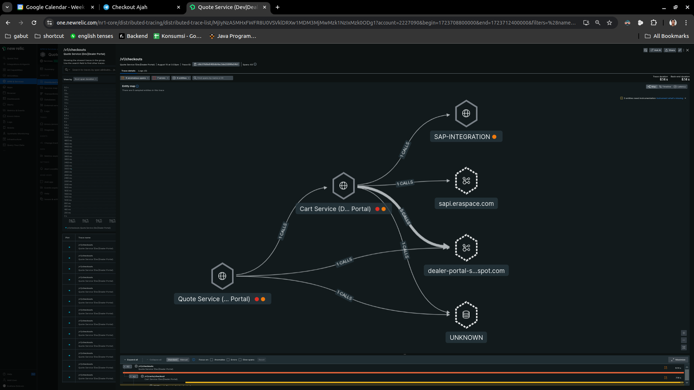
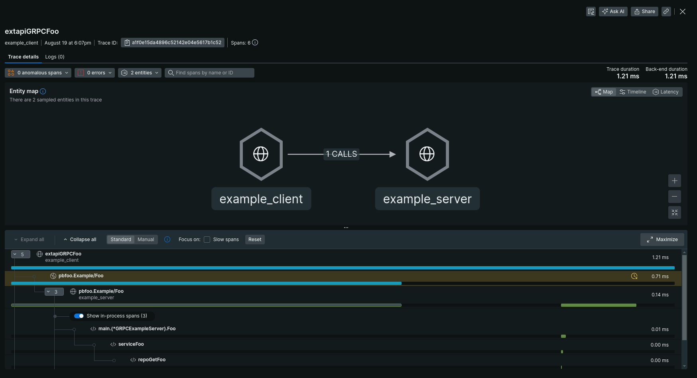
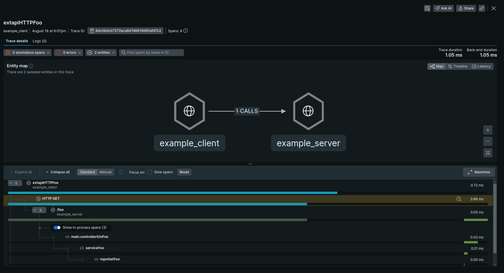

# go-opentelemetry v2

Go OpenTelemetry Helper.

Why we need `v2`?

1. Span trace front to back (context propagation).
2. Upgrade go version to `v1.21.0` and otel version from `v1.10.0` to `v1.28.0`, see [why_need_upgrade_version](./why_need_upgrade_version.md).
3. Better library API. See [better_api.md](./better_api.md)

## Feature

- [x] Opentelemetry Trace
- [x] Opentelemetry Context Propagation




## Installation v2

```bash
go get github.com/erajayatech/go-opentelemetry/v2
```

```go
import gootel "github.com/erajayatech/go-opentelemetry/v2"
```

## Checklist implement v2

Here is checklist for you to check wheter you already implement this `v2` fully.

1. Your import is using `v2` and rename gootel.

```go
import gootel "github.com/erajayatech/go-opentelemetry/v2"
```

2. You create new trace provider and shutdown it properly. See [example](./example/server/main.go).

```go
tp, err := gootel.NewTraceProvider(context.Background())
fatalIfErr(err)
defer func() {
    err := tp.Shutdown(context.Background())
    warnIfErr(err)
}()
```

3. You create new trace provider and shutdown it properly. See [example](./example/server/main.go).

```go
mp, err := gootel.NewMeterProvider(context.Background())
fatalIfErr(err)
defer func() {
    err := mp.Shutdown(context.Background())
    warnIfErr(err)
}()
```

4. Your server ready to receive context propagation. See [example gin](./example/server/server_gin.go) and See [example grpc](./example/server/server_grpc.go).

```go
ginEngine := gin.Default()
ginEngine.Use(otelgin.Middleware(""))
```

```go
grpcServer := grpc.NewServer(grpc.StatsHandler(otelgrpc.NewServerHandler()))
```

5. You record the span.

```go
ctx, span := gootel.RecordSpan(ctx)
defer span.End()
```

6. Your client sent context propagation. See [example http](./example/client/http.go) and [example grpc](./example/client/grpc.go).

```go
client := &http.Client{Transport: otelhttp.NewTransport(http.DefaultTransport)}
req, err := http.NewRequestWithContext(ctx, http.MethodGet, "http://localhost:4000/foo", nil)
```

```go
conn, err := grpc.NewClient("localhost:4001", grpc.WithStatsHandler(otelgrpc.NewClientHandler()), grpc.WithTransportCredentials(insecure.NewCredentials()))
```

## Usage

See [example server](./example/server/main.go) and [example client](./example/client/main.go).

In New Relic you will get.





## Migrate from v1

See [Migrate from v1](./migrate_from_v1.md)

## Things should be highlighted in `v2`

See [highlighted_in_v2.md](./highlighted_in_v2.md)
