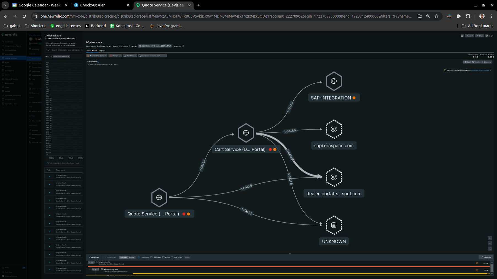
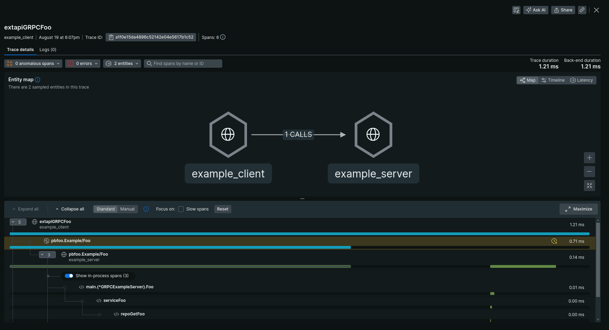
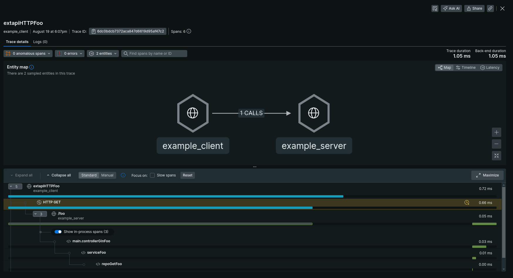

# go-opentelemetry v2

Go OpenTelemetry Helper.

Why we need `v2`?

1. Span trace front to back (context propagation).
2. Upgrade go version to `v1.21.0` and otel version from `v1.10.0` to `v1.28.0`, see [why_need_upgrade_version](./why_need_upgrade_version.md).
3. Better library API. See [better_api.md](./better_api.md)

## Feature

- [x] Opentelemetry Trace
- [x] Opentelemetry Context Propagation




## Installation v2

```bash
go get github.com/erajayatech/go-opentelemetry/v2
```

```go
import gootel "github.com/erajayatech/go-opentelemetry/v2"
```

## Checklist implement v2

Here is checklist for you to check wheter you already implement this `v2` fully.

1. Your import is using `v2` and ranme.

```go
import gootel "github.com/erajayatech/go-opentelemetry/v2"
```

2. You create new trace provider and shutdown it properly. See [example](./example/server/main.go).

```go
tp, err := gootel.NewTraceProvider(context.Background())
fatalIfErr(err)
defer func() {
    err := tp.Shutdown(context.Background())
    warnIfErr(err)
}()
```

3. Your server ready to receive context propagation. See [example gin](./example/server/server_gin.go) and See [example grpc](./example/server/server_grpc.go).

```go
ginEngine := gin.Default()
ginEngine.Use(otelgin.Middleware(""))
```

```go
grpcServer := grpc.NewServer(grpc.StatsHandler(otelgrpc.NewServerHandler()))
```

4. You record the span.

```go
ctx, span := gootel.RecordSpan(ctx)
defer span.End()
```

5. Your client sent context propagation. See [example http](./example/client/http.go) and [example grpc](./example/client/grpc.go).

```go
client := &http.Client{Transport: otelhttp.NewTransport(http.DefaultTransport)}
req, err := http.NewRequestWithContext(ctx, http.MethodGet, "http://localhost:4000/foo", nil)
```

```go
conn, err := grpc.NewClient("localhost:4001", grpc.WithStatsHandler(otelgrpc.NewClientHandler()), grpc.WithTransportCredentials(insecure.NewCredentials()))
```

## Usage

See [example server](./example/server/main.go) and [example client](./example/client/main.go).

In New Relic you will get.





## Enhanced Tracing Helpers

### HTTP Client Tracing

Helper functions for tracing HTTP client requests with semantic attributes:

```go
import (
    "context"
    "time"
    gootel "github.com/erajayatech/go-opentelemetry/v2"
)

func makeHTTPRequest(ctx context.Context) error {
    ctx, span := gootel.TraceHTTPRequest(ctx, "my-service", "GET", "http://api.example.com/users")
    defer span.End()

    startTime := time.Now()
    
    resp, err := http.DefaultClient.Do(req)
    duration := time.Since(startTime)

    if err != nil {
        gootel.RecordHTTPError(span, err)
        return err
    }

    gootel.RecordHTTPSuccess(span, resp.StatusCode, duration)
    return nil
}
```

Available functions:
- `TraceHTTPRequest(ctx, serviceName, method, url)` - Creates HTTP client span
- `RecordHTTPSuccess(span, statusCode, duration)` - Records successful HTTP response
- `RecordHTTPError(span, err)` - Records HTTP error

Available attributes:
- `HTTPMethodKey`, `HTTPURLKey`, `HTTPStatusCodeKey`, `HTTPServiceKey`
- `HTTPDurationKey`, `HTTPErrorKey`, `HTTPTargetKey`, `SpanKindKey`

### Database Tracing (GORM)

Helper functions for tracing GORM database operations with multi-database support:

```go
import (
    "gorm.io/gorm"
    gootel "github.com/erajayatech/go-opentelemetry/v2"
)

func setupPostgreSQL(db *gorm.DB) {
    gootel.SetupGORMTracing(db, "postgresql", "myapp")
}

func setupMySQL(db *gorm.DB) {
    gootel.SetupGORMTracing(db, "mysql", "myapp")
}

func setupCouchbase(db *gorm.DB) {
    gootel.SetupGORMTracing(db, "couchbase", "myapp")
}

func setupCockroachDB(db *gorm.DB) {
    gootel.SetupGORMTracing(db, "cockroachdb", "myapp")
}

func queryUsers(ctx context.Context, db *gorm.DB) ([]User, error) {
    ctx, span := gootel.TraceDBOperation(ctx, "postgresql", "myapp", "SELECT", "SELECT * FROM users")
    defer span.End()

    startTime := time.Now()
    var users []User
    err := db.WithContext(ctx).Find(&users).Error
    duration := time.Since(startTime)

    if err != nil {
        gootel.RecordDBError(span, err)
        return nil, err
    }

    gootel.RecordDBSuccess(span, len(users), duration)
    return users, nil
}
```

Supported database systems:
- `postgresql` - PostgreSQL
- `mysql` - MySQL
- `sqlite` - SQLite
- `sqlserver` - Microsoft SQL Server
- `mongodb` - MongoDB
- `couchbase` - Couchbase
- `cassandra` - Cassandra
- `cockroachdb` - CockroachDB
- And any other database system following OpenTelemetry conventions

Available functions:
- `TraceDBOperation(ctx, system, name, operation, statement)` - Creates database operation span
- `RecordDBSuccess(span, rowCount, duration)` - Records successful database operation
- `RecordDBError(span, err)` - Records database error
- `RecordDBQueryStats(span, duration, rowCount)` - Records query statistics
- `RecordDBQueryEvent(span, statement)` - Logs query as span event for debugging
- `SetupGORMTracing(db, system, name)` - Sets up automatic GORM callbacks for CRUD operations

**Query Events**: When using `SetupGORMTracing`, all SQL queries are automatically logged as span events, making them visible in tracing UI (Jaeger, New Relic, etc.) for easy debugging and monitoring.

Available attributes:
- `DBSystemKey`, `DBNameKey`, `DBStatementKey`, `DBOperationKey`
- `DBUserKey`, `DBConnectionStringKey`, `DBDurationKey`, `DBSuccessKey`
- `DBErrorKey`, `DBRowCountKey`

### Redis Tracing

Helper functions for tracing Redis operations:

```go
import (
    "context"
    "time"
    gootel "github.com/erajayatech/go-opentelemetry/v2"
)

func cacheGet(ctx context.Context, client *redis.Client, key string) (string, error) {
    ctx, span := gootel.TraceRedisOperation(ctx, "GET", key, 0)
    defer span.End()

    startTime := time.Now()
    val, err := client.Get(ctx, key).Result()
    duration := time.Since(startTime)

    if err != nil {
        if err == redis.Nil {
            gootel.RecordRedisSuccess(span, duration, false)
            return "", nil
        }
        gootel.RecordRedisError(span, err)
        return "", err
    }

    gootel.RecordRedisSuccess(span, duration, true)
    return val, nil
}
```

Available functions:
- `TraceRedisOperation(ctx, operation, key, db)` - Creates Redis operation span
- `RecordRedisSuccess(span, duration, found)` - Records successful Redis operation
- `RecordRedisError(span, err)` - Records Redis error

Available attributes:
- `RedisOperationKey`, `RedisKeyKey`, `RedisDBKey`, `RedisDurationKey`
- `RedisSuccessKey`, `RedisErrorKey`, `RedisFoundKey`

### Business Attributes

Helper functions for tracking business-level attributes, metrics, and events with generic support for any domain:

```go
import (
    "context"
    gootel "github.com/erajayatech/go-opentelemetry/v2"
)

func processOrder(ctx context.Context, orderID string) error {
    ctx, span := gootel.RecordSpan(ctx)
    defer span.End()

    gootel.AddBusinessAttribute(span, "order.id", "ORDER-12345")
    gootel.AddBusinessAttribute(span, "customer.id", "CUST-67890")

    gootel.AddBusinessEvent(span, "order.created", map[string]interface{}{
        "order_id": orderID,
        "amount":   150.50,
    })

    return nil
}

func processShipment(ctx context.Context, trackingID string) error {
    ctx, span := gootel.RecordSpan(ctx)
    defer span.End()

    gootel.AddBusinessAttribute(span, "shipment.tracking", trackingID)
    gootel.AddBusinessAttribute(span, "warehouse.id", "WH-001")

    return nil
}

func trackBusinessMetrics(ctx context.Context) {
    _, span := gootel.RecordSpan(ctx)
    defer span.End()

    gootel.RecordBusinessMetric(span, "cart.value", 150.50)
    gootel.RecordBusinessMetric(span, "conversion.rate", 0.75)
    gootel.RecordBusinessMetric(span, "session.duration", 300)
    gootel.RecordBusinessMetric(span, "order.count", 42)
}

func addBusinessContext(ctx context.Context) {
    _, span := gootel.RecordSpan(ctx)
    defer span.End()

    orderContext := map[string]string{
        "id":     "ORDER-12345",
        "status": "processing",
    }
    gootel.AddBusinessContext(span, "order", orderContext)

    userContext := map[string]string{
        "id":   "CUST-001",
        "role": "admin",
    }
    gootel.AddBusinessContext(span, "user", userContext)
}

func addMultipleBusinessAttributes(ctx context.Context) {
    _, span := gootel.RecordSpan(ctx)
    defer span.End()

    attrs := map[string]string{
        "order.id":     "ORDER-12345",
        "customer.id":  "CUST-001",
        "payment.method": "credit_card",
    }
    gootel.AddBusinessAttributes(span, attrs)
}

func handlePaymentError(ctx context.Context, orderID string, err error) {
    _, span := gootel.RecordSpan(ctx)
    defer span.End()

    gootel.AddBusinessAttribute(span, "order.id", "ORDER-12345")
    gootel.RecordBusinessError(span, "PAYMENT_ERROR", err)
}
```

Available functions:
- `AddBusinessAttribute(span, key, value)` - Adds single business-level attribute to span
- `AddBusinessAttributes(span, attrs)` - Adds multiple business-level attributes to span at once (more efficient)
- `AddBusinessEvent(span, name, data)` - Records business event with data
- `RecordBusinessError(span, errorCode, err)` - Records business error with error code
- `RecordBusinessMetric(span, metricName, value)` - Records business metric/value (supports int, int64, float64, string, bool)
- `AddBusinessContext(span, contextType, contextData)` - Adds business context information with prefix

Available attributes:
- `BusinessErrorKey`, `BusinessEventKey`

Generic usage examples:
- E-commerce: `order.id`, `customer.id`, `cart.id`, `product.id`, `payment.method`
- Shipment: `shipment.tracking`, `warehouse.id`, `carrier.id`, `delivery.status`
- Inventory: `inventory.sku`, `stock.level`, `warehouse.location`, `reorder.point`
- Workflow: `workflow.id`, `task.id`, `process.step`, `execution.status`
- Transaction: `transaction.ref`, `payment.ref`, `settlement.id`, `batch.id`
- Any other domain-specific attributes you need

### Enhanced Span Helpers

Helper functions for enhanced error handling and trace/span ID extraction:

```go
import (
    "context"
    gootel "github.com/erajayatech/go-opentelemetry/v2"
)

func processRequest(ctx context.Context) error {
    ctx, span := gootel.RecordSpan(ctx)
    defer span.End()

    traceID := gootel.GetTraceID(ctx)
    spanID := gootel.GetSpanID(ctx)
    
    log.Printf("Processing request - TraceID: %s, SpanID: %s", traceID, spanID)

    if err := someOperation(); err != nil {
        gootel.RecordErrorToSpan(ctx, err)
        return err
    }

    gootel.AddEventToSpan(ctx, "checkpoint.reached", map[string]interface{}{
        "step": 1,
        "status": "completed",
    })

    return nil
}

func handlePanic(ctx context.Context) {
    if r := recover(); r != nil {
        gootel.AddExceptionToSpan(ctx, r)
    }
}
```

Available functions:
- `GetTraceID(ctx)` - Extracts trace ID from context
- `GetSpanID(ctx)` - Extracts span ID from context
- `RecordErrorToSpan(ctx, err)` - Records error to span with details
- `AddEventToSpan(ctx, name, data)` - Adds event with data to span
- `AddExceptionToSpan(ctx, exception)` - Records exception/panic to span

### Semantic Conventions

All tracing helpers follow OpenTelemetry semantic conventions for consistent attribute naming and structure across different systems.

### Best Practices

1. Always use context propagation across service boundaries
2. Use specific tracing helpers for each operation type (HTTP, DB, Redis)
3. Add business attributes for domain-specific context
4. Record errors with proper context using enhanced helpers
5. Extract trace/span IDs for logging and debugging
6. Maintain backward compatibility with existing `RecordSpan` function

## Trace Provider Exporters

Version 2 provides comprehensive support for exporting traces to multiple destinations following OpenTelemetry standards. Each exporter is implemented as a separate function for maximum flexibility and configurability.

### Available Exporters

1. **New Relic** - Production-ready observability platform
2. **Datadog** - Cloud monitoring and security platform
3. **Jaeger** - Distributed tracing system (local development)
4. **OTLP** - Generic OpenTelemetry Protocol exporter (compatible with any OTLP receiver)
5. **Stdout/Console** - Console output for debugging and development
6. **Multiple Exporters** - Export to multiple destinations simultaneously

### Exporter Configuration

All exporters use a common configuration structure:

```go
type ExporterConfig struct {
    ServiceName    string
    ServiceVersion string
    Environment    string
}
```

### New Relic Exporter

Export traces to New Relic using OTLP gRPC protocol.

**Basic Usage:**

```go
import (
    "context"
    gootel "github.com/erajayatech/go-opentelemetry/v2"
)

func main() {
    ctx := context.Background()

    config := gootel.ExporterConfig{
        ServiceName:    "my-service",
        ServiceVersion: "1.0.0",
        Environment:    "production",
    }

    tp, err := gootel.NewTraceProviderWithNewRelic(
        ctx,
        config,
        os.Getenv("NEW_RELIC_API_KEY"),
        "otlp.nr-data.net:4317",
    )
    if err != nil {
        log.Fatal(err)
    }
    defer tp.Shutdown(ctx)

    otel.SetTracerProvider(tp)

    ctx, span := gootel.RecordSpan(ctx)
    defer span.End()

    gootel.AddBusinessAttribute(span, "test", "value")
}
```

**Environment Variables:**

```bash
export NEW_RELIC_API_KEY="your-new-relic-api-key"
export NEW_RELIC_ENDPOINT="otlp.nr-data.net:4317"
```

**Features:**
- OTLP gRPC protocol with gzip compression
- Automatic resource attribute tagging
- Compatible with New Relic APM
- Production-ready with built-in retries

### Datadog Exporter

Export traces to Datadog using OTLP gRPC or HTTP protocol.

**Basic Usage (gRPC):**

```go
import (
    "context"
    gootel "github.com/erajayatech/go-opentelemetry/v2"
)

func main() {
    ctx := context.Background()

    config := gootel.ExporterConfig{
        ServiceName:    "my-service",
        ServiceVersion: "1.0.0",
        Environment:    "production",
    }

    tp, err := gootel.NewTraceProviderWithDatadog(
        ctx,
        config,
        os.Getenv("DATADOG_API_KEY"),
        "trace-agent.datadoghq.com:4317",
        false,
    )
    if err != nil {
        log.Fatal(err)
    }
    defer tp.Shutdown(ctx)

    otel.SetTracerProvider(tp)

    ctx, span := gootel.RecordSpan(ctx)
    defer span.End()

    gootel.AddBusinessAttribute(span, "test", "value")
}
```

**Basic Usage (HTTP):**

```go
tp, err := gootel.NewTraceProviderWithDatadog(
    ctx,
    config,
    os.Getenv("DATADOG_API_KEY"),
    "trace-agent.datadoghq.com:4318",
    true,
)
```

**Environment Variables:**

```bash
export DATADOG_API_KEY="your-datadog-api-key"
export DATADOG_ENDPOINT="trace-agent.datadoghq.com:4317"
```

**Features:**
- Support for both gRPC and HTTP protocols
- Automatic API key authentication
- Compatible with Datadog APM
- Gzip compression enabled by default

### Jaeger Exporter

Export traces to Jaeger using OTLP gRPC protocol. Ideal for local development and testing.

**Basic Usage:**

```go
import (
    "context"
    gootel "github.com/erajayatech/go-opentelemetry/v2"
)

func main() {
    ctx := context.Background()

    config := gootel.ExporterConfig{
        ServiceName:    "my-service",
        ServiceVersion: "1.0.0",
        Environment:    "development",
    }

    tp, err := gootel.NewTraceProviderWithJaeger(
        ctx,
        config,
        "localhost:4317",
    )
    if err != nil {
        log.Fatal(err)
    }
    defer tp.Shutdown(ctx)

    otel.SetTracerProvider(tp)

    ctx, span := gootel.RecordSpan(ctx)
    defer span.End()

    gootel.AddBusinessAttribute(span, "test", "value")
}
```

**Running Jaeger locally with Docker:**

```bash
docker run -d --name jaeger \
  -e COLLECTOR_OTLP_ENABLED=true \
  -p 16686:16686 \
  -p 4317:4317 \
  -p 4318:4318 \
  jaegertracing/all-in-one:latest
```

Access Jaeger UI at: http://localhost:16686

**Features:**
- Perfect for local development
- Real-time trace visualization
- No authentication required
- Lightweight and easy to setup

### OTLP Generic Exporter

Export traces to any OTLP-compatible receiver using gRPC or HTTP protocol.

**Basic Usage (gRPC):**

```go
import (
    "context"
    gootel "github.com/erajayatech/go-opentelemetry/v2"
)

func main() {
    ctx := context.Background()

    config := gootel.ExporterConfig{
        ServiceName:    "my-service",
        ServiceVersion: "1.0.0",
        Environment:    "production",
    }

    headers := map[string]string{
        "Authorization": "Bearer your-token",
        "X-Custom-Header": "custom-value",
    }

    tp, err := gootel.NewTraceProviderWithOTLP(
        ctx,
        config,
        "your-otlp-endpoint:4317",
        false,
        headers,
    )
    if err != nil {
        log.Fatal(err)
    }
    defer tp.Shutdown(ctx)

    otel.SetTracerProvider(tp)
}
```

**Basic Usage (HTTP):**

```go
tp, err := gootel.NewTraceProviderWithOTLP(
    ctx,
    config,
    "your-otlp-endpoint:4318",
    true,
    headers,
)
```

**Features:**
- Compatible with any OTLP receiver
- Support for custom headers
- Both gRPC and HTTP protocols
- Gzip compression enabled

### Stdout/Console Exporter

Export traces to console for debugging and development purposes.

**Basic Usage:**

```go
import (
    gootel "github.com/erajayatech/go-opentelemetry/v2"
)

func main() {
    config := gootel.ExporterConfig{
        ServiceName:    "my-service",
        ServiceVersion: "1.0.0",
        Environment:    "development",
    }

    tp, err := gootel.NewTraceProviderWithStdout(config, true)
    if err != nil {
        log.Fatal(err)
    }
    defer tp.Shutdown(context.Background())

    otel.SetTracerProvider(tp)

    ctx, span := gootel.RecordSpan(context.Background())
    defer span.End()

    gootel.AddBusinessAttribute(span, "test", "value")
}
```

**Features:**
- Pretty-print option for readability
- No external dependencies
- Perfect for local development
- Instant trace visibility

### Multiple Exporters

Export traces to multiple destinations simultaneously for comprehensive observability.

**Basic Usage:**

```go
import (
    "context"
    gootel "github.com/erajayatech/go-opentelemetry/v2"
    "go.opentelemetry.io/otel/exporters/otlp/otlptrace/otlptracegrpc"
    "go.opentelemetry.io/otel/exporters/otlp/otlptrace/otlptracehttp"
)

func main() {
    ctx := context.Background()

    config := gootel.ExporterConfig{
        ServiceName:    "my-service",
        ServiceVersion: "1.0.0",
        Environment:    "production",
    }

    nrExporter, err := otlptracegrpc.New(ctx,
        otlptracegrpc.WithEndpoint("otlp.nr-data.net:4317"),
        otlptracegrpc.WithHeaders(map[string]string{"api-key": os.Getenv("NEW_RELIC_API_KEY")}),
    )
    if err != nil {
        log.Fatal(err)
    }

    jaegerExporter, err := otlptracegrpc.New(ctx,
        otlptracegrpc.WithEndpoint("localhost:4317"),
        otlptracegrpc.WithInsecure(),
    )
    if err != nil {
        log.Fatal(err)
    }

    exporters := []sdktrace.SpanExporter{nrExporter, jaegerExporter}

    tp, err := gootel.NewTraceProviderWithMultipleExporters(ctx, config, exporters)
    if err != nil {
        log.Fatal(err)
    }
    defer tp.Shutdown(ctx)

    otel.SetTracerProvider(tp)
}
```

**Features:**
- Export to multiple destinations simultaneously
- Independent configuration per exporter
- Graceful shutdown handling
- Production-ready redundancy

### Environment-Based Configuration

For production deployments, use environment variables to configure exporters:

```go
func createTraceProvider(ctx context.Context) (*sdktrace.TracerProvider, error) {
    config := gootel.ExporterConfig{
        ServiceName:    os.Getenv("SERVICE_NAME"),
        ServiceVersion: os.Getenv("SERVICE_VERSION"),
        Environment:    os.Getenv("APP_ENV"),
    }

    exporter := os.Getenv("OTEL_EXPORTER")

    switch exporter {
    case "newrelic":
        return gootel.NewTraceProviderWithNewRelic(
            ctx,
            config,
            os.Getenv("NEW_RELIC_API_KEY"),
            os.Getenv("NEW_RELIC_ENDPOINT"),
        )
    case "datadog":
        return gootel.NewTraceProviderWithDatadog(
            ctx,
            config,
            os.Getenv("DATADOG_API_KEY"),
            os.Getenv("DATADOG_ENDPOINT"),
            os.Getenv("DATADOG_USE_HTTP") == "true",
        )
    case "jaeger":
        return gootel.NewTraceProviderWithJaeger(
            ctx,
            config,
            os.Getenv("JAEGER_ENDPOINT"),
        )
    case "otlp":
        return gootel.NewTraceProviderWithOTLP(
            ctx,
            config,
            os.Getenv("OTLP_ENDPOINT"),
            os.Getenv("OTLP_USE_HTTP") == "true",
            parseHeaders(os.Getenv("OTLP_HEADERS")),
        )
    case "stdout":
        return gootel.NewTraceProviderWithStdout(config, os.Getenv("OTEL_PRETTY_PRINT") == "true")
    default:
        return nil, fmt.Errorf("unsupported exporter: %s", exporter)
    }
}
```

**Environment Variables:**

```bash
# Common
export SERVICE_NAME="my-service"
export SERVICE_VERSION="1.0.0"
export APP_ENV="production"

# Exporter Selection
export OTEL_EXPORTER="newrelic"

# New Relic
export NEW_RELIC_API_KEY="your-api-key"
export NEW_RELIC_ENDPOINT="otlp.nr-data.net:4317"

# Datadog
export DATADOG_API_KEY="your-api-key"
export DATADOG_ENDPOINT="trace-agent.datadoghq.com:4317"
export DATADOG_USE_HTTP="false"

# Jaeger
export JAEGER_ENDPOINT="localhost:4317"

# OTLP
export OTLP_ENDPOINT="localhost:4317"
export OTLP_USE_HTTP="false"
export OTLP_HEADERS="Authorization:Bearer token,X-Custom:value"

# Stdout
export OTEL_PRETTY_PRINT="true"
```

### Best Practices

1. **Use Stdout for Development**: Perfect for local development and debugging
2. **Use Jaeger for Local Testing**: Quick setup for multi-service tracing
3. **Use New Relic/Datadog for Production**: Comprehensive observability and alerting
4. **Use Multiple Exporters for Critical Services**: Redundancy and comprehensive monitoring
5. **Always Shutdown Trace Providers**: Proper resource cleanup
6. **Use Environment Variables**: Flexible configuration across environments
7. **Enable Gzip Compression**: Reduce network overhead for production

### Migration from Legacy TraceProvider

If you're using the legacy `NewTraceProvider` function, migration is straightforward:

**Before:**
```go
tp, err := gootel.NewTraceProvider(ctx)
```

**After:**
```go
config := gootel.ExporterConfig{
    ServiceName:    os.Getenv("SERVICE_NAME"),
    ServiceVersion: os.Getenv("SERVICE_VERSION"),
    Environment:    os.Getenv("APP_ENV"),
}

tp, err := gootel.NewTraceProviderWithNewRelic(ctx, config, apiKey, endpoint)
```

The new exporter providers offer more flexibility and explicit configuration options.

## Migrate from v1

See [Migrate from v1](./migrate_from_v1.md)

### Using New Enhanced Tracing Helpers

The enhanced tracing helpers in v2 provide a drop-in replacement for manual span creation while maintaining full backward compatibility with the existing `RecordSpan` function:

**Before (v1):**
```go
ctx, span := gootel.RecordSpan(ctx)
defer span.End()

span.SetAttributes(attribute.String("http.method", "GET"))
span.SetAttributes(attribute.String("http.url", url))

if err != nil {
    span.RecordError(err)
    span.SetStatus(codes.Error, err.Error())
    return err
}

span.SetStatus(codes.Ok, "")
```

**After (v2 with HTTP helper):**
```go
ctx, span := gootel.TraceHTTPRequest(ctx, "my-service", "GET", url)
defer span.End()

if err != nil {
    gootel.RecordHTTPError(span, err)
    return err
}

gootel.RecordHTTPSuccess(span, statusCode, duration)
```

The new helpers:
- Automatically set appropriate span attributes following OpenTelemetry conventions
- Handle error recording and span status automatically
- Provide consistent API across different operation types
- Work seamlessly with existing context propagation mechanisms
- Maintain full compatibility with the existing `RecordSpan` function

## Things should be highlighted in `v2`

See [highlighted_in_v2.md](./highlighted_in_v2.md)
