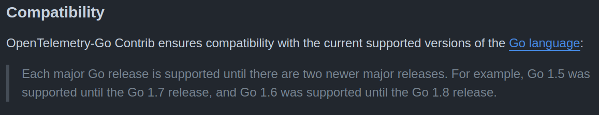

# go-opentelemetry v2

Go OpenTelemetry Helper.

## Why we need to upgrade version.

Main feature `v2` is context propagation.


For this we need to use otel contrib.

```go
import (
    "go.opentelemetry.io/contrib/instrumentation/github.com/gin-gonic/gin/otelgin"
    "go.opentelemetry.io/contrib/instrumentation/google.golang.org/grpc/otelgrpc"
    "go.opentelemetry.io/contrib/instrumentation/net/http/otelhttp"
)
```

But, using otel contrib will required atleast go `v1.21` and otel `v1.28`.

<details>
    <summary>Why otel contrib required atleast go `v1.21`</summary>
    
Because otel contrib only support 2 latest version.

See [otel contrib compatibility](https://github.com/open-telemetry/opentelemetry-go-contrib?tab=readme-ov-file#compatibility)



</details>

<details>
    <summary>What is wrong with upgrade go version to `v1.21`</summary>

Every service who use the library will have to use go `v1.21`

</details>

<details>
    <summary>what is wrong with upgrade otel version to v1.28?</summary>

because in this version some package being removed

```
go.opentelemetry.io/otel/metric/global                      remove in v1.16/v0.39  https://github.com/open-telemetry/opentelemetry-go/releases/tag/v1.16.0-rc.1
go.opentelemetry.io/otel/metric/instrument                  remove in v1.16/v0.39  https://github.com/open-telemetry/opentelemetry-go/releases/tag/v1.16.0
go.opentelemetry.io/otel/sdk/metric/aggregator/histogram    remove in v0.32        https://github.com/open-telemetry/opentelemetry-go/releases/tag/sdk%2Fmetric%2Fv0.32.0
go.opentelemetry.io/otel/sdk/metric/controller/basic        remove in v0.32        https://github.com/open-telemetry/opentelemetry-go/releases/tag/sdk%2Fmetric%2Fv0.32.0
go.opentelemetry.io/otel/sdk/metric/export/aggregation      remove in v0.32        https://github.com/open-telemetry/opentelemetry-go/releases/tag/sdk%2Fmetric%2Fv0.32.0
go.opentelemetry.io/otel/sdk/metric/processor/basic         remove in v0.32        https://github.com/open-telemetry/opentelemetry-go/releases/tag/sdk%2Fmetric%2Fv0.32.0
go.opentelemetry.io/otel/sdk/metric/sdkapi                  remove in v0.32        https://github.com/open-telemetry/opentelemetry-go/releases/tag/sdk%2Fmetric%2Fv0.32.0
go.opentelemetry.io/otel/sdk/metric/selector/simple         remove in v0.32        https://github.com/open-telemetry/opentelemetry-go/releases/tag/sdk%2Fmetric%2Fv0.32.0
go.opentelemetry.io/otel/exporters/jaeger                   remove in v1.18/v0.41  https://github.com/open-telemetry/opentelemetry-go/releases/tag/v1.18.0
go.opentelemetry.io/otel/exporters/otlp/otlpmetric          remove in v1.21/v0.44  https://github.com/open-telemetry/opentelemetry-go/releases/tag/v1.21.0
```

and in erajayatech/go-opentelemetry `v1`, this package is being used, that is why we choose to have erajayatech/go-opentelemetry `v2`.

</details>
